# 💸 Expense Tracker

A simple and intuitive Flutter app to track your daily, weekly, and monthly expenses. Helps you manage your personal finances with categorized transactions, charts, and budget insights.

---

## 🚀 Features

- Add, edit and delete expense transactions
- Categorize transactions (e.g., Food, Transportation, Bills)
- View spending history by date or category
- Pie chart or bar graph visualization of expenses
- Persistent local storage (Hive)
- Responsive UI for Android, iOS, Windows and Web

---

## 🛠️ Tech Stack

- **Flutter**: UI toolkit
- **Dart**: Programming language
- **Hive**: Local storage
- **Riverpod**: State management
- **Flutter Charts / fl_chart**: Data visualization

---

## 📦 Platforms Supported

- 🕹️ Web (HTML5)
- 💻 Windows
- 📱 Android

---

## 📸 Screenshots

> Screenshots from each platform

### 🖥️ Windows

| Home                                                              | New                                                             | Chart                                                               |
|-------------------------------------------------------------------|-----------------------------------------------------------------|---------------------------------------------------------------------|
| 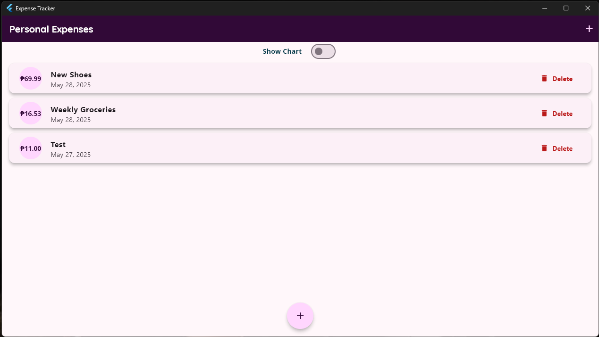 | 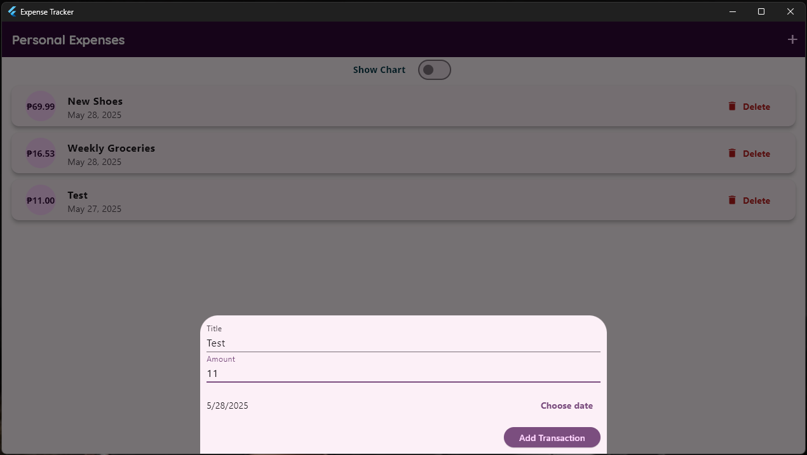 | 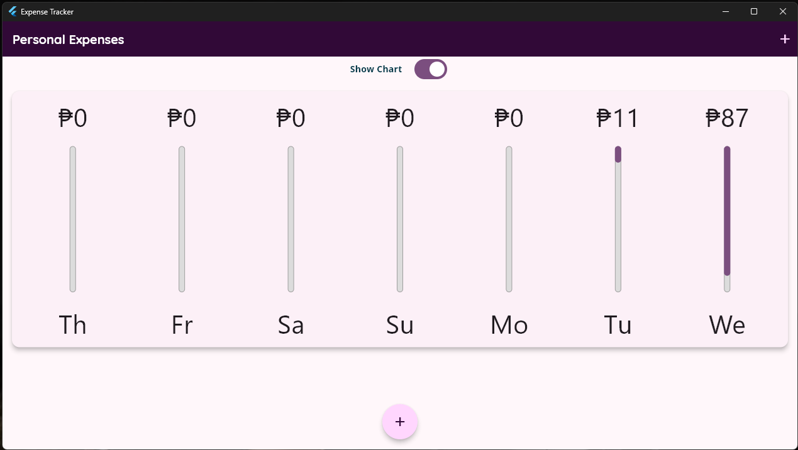 |
| 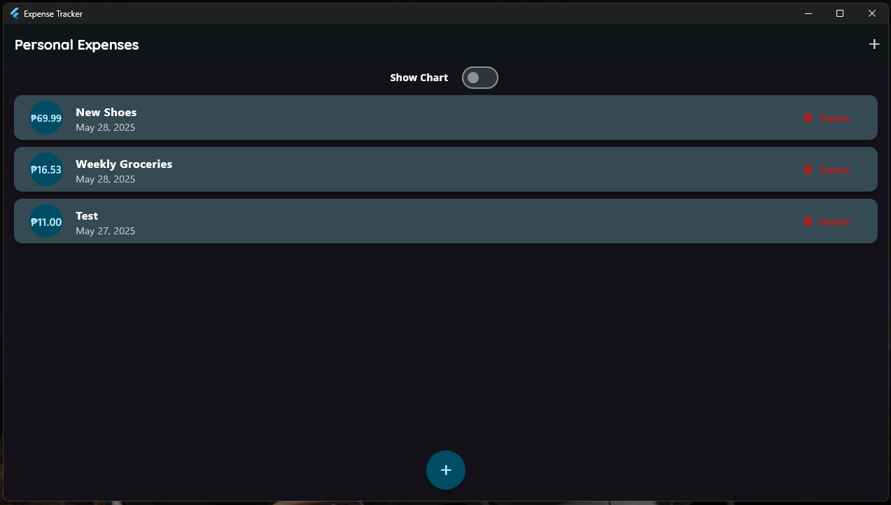   | 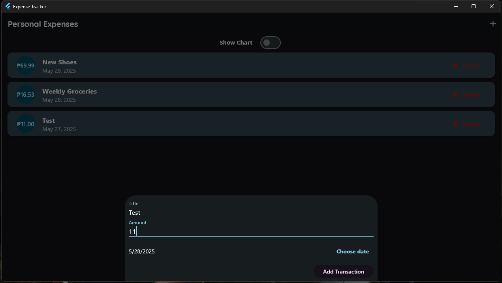   | 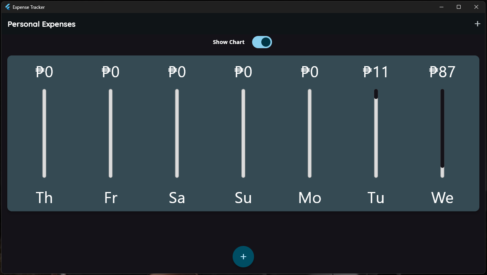   |

### 🌐 Web

| Home                                                  | New                                                 | Chart                                                       |
|-------------------------------------------------------|-----------------------------------------------------|-------------------------------------------------------------|
| 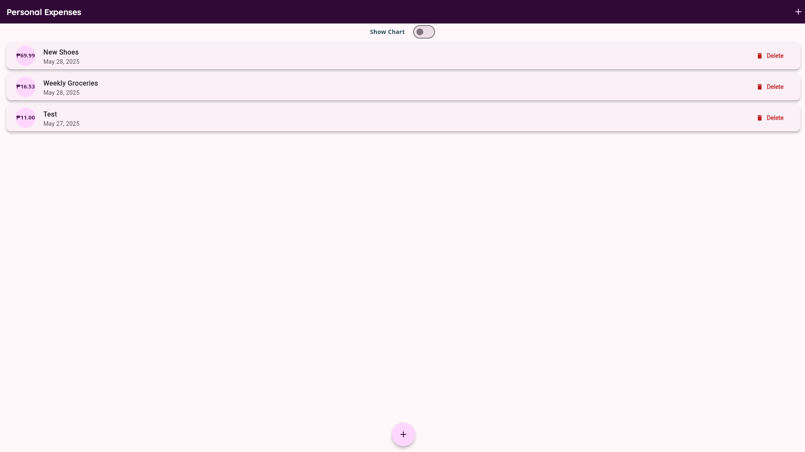 | 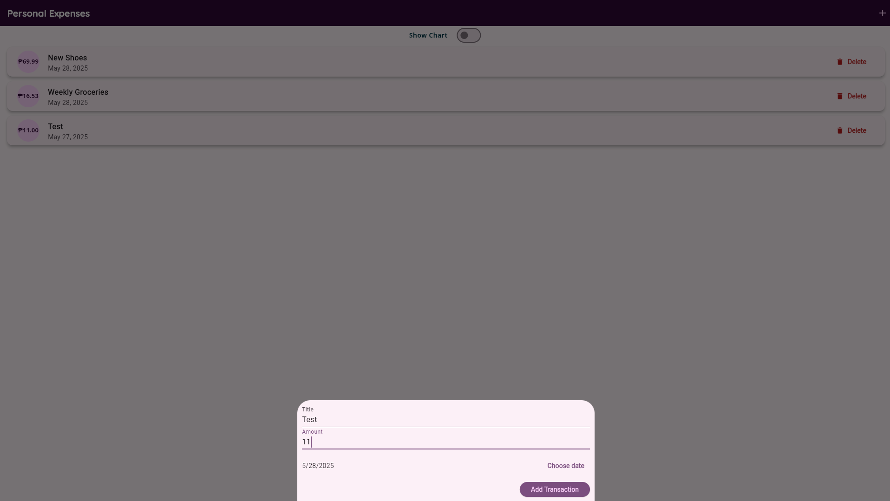 |  |
| 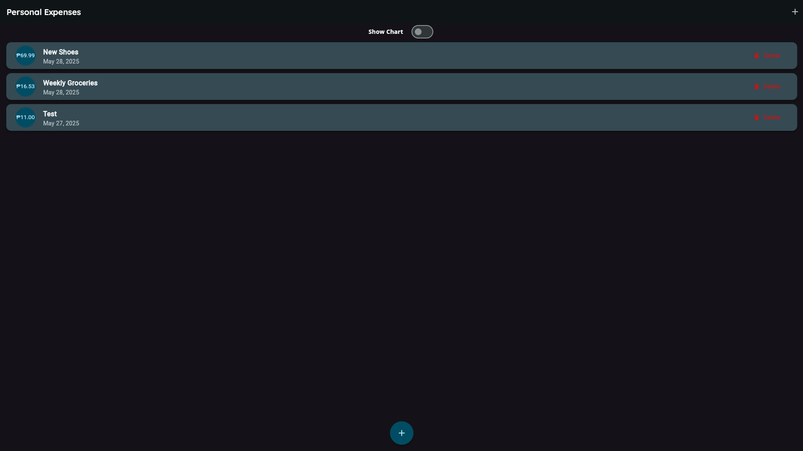   | 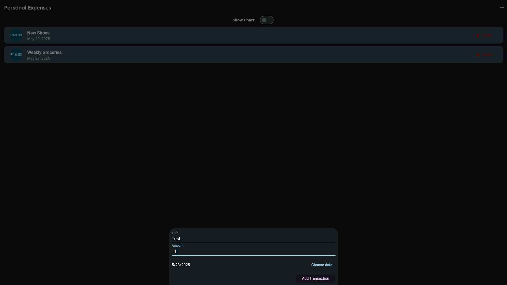   | 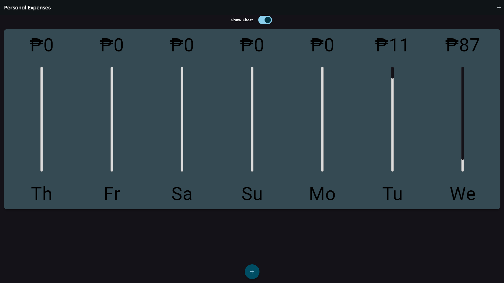   |

### 📱 Android

| Home                                                                        | New                                                                       | Chart                                                                         |
|-----------------------------------------------------------------------------|---------------------------------------------------------------------------|-------------------------------------------------------------------------------|
| 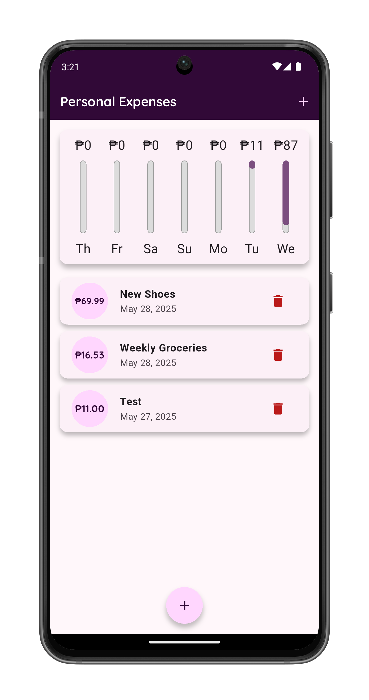  | 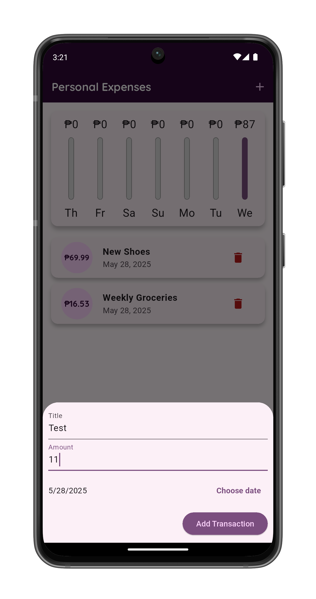  |                                                                               |
| 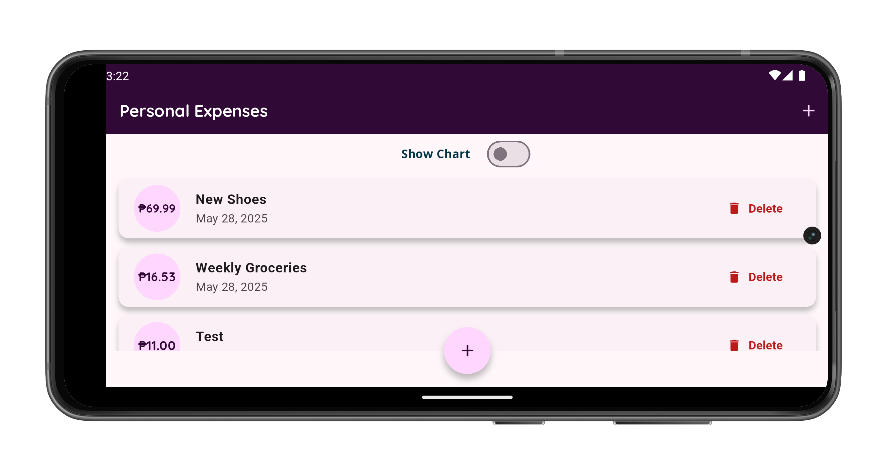 |  | 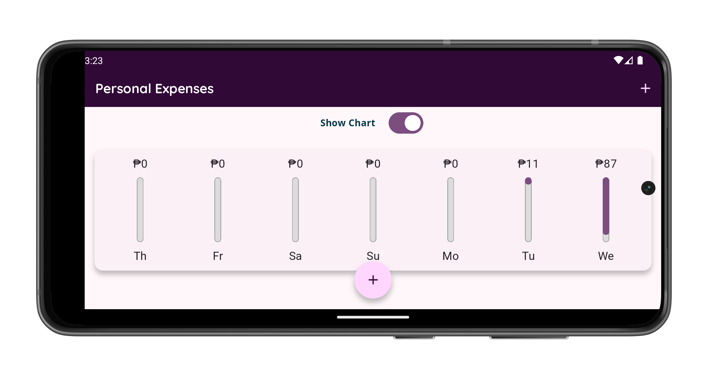 |
|     | 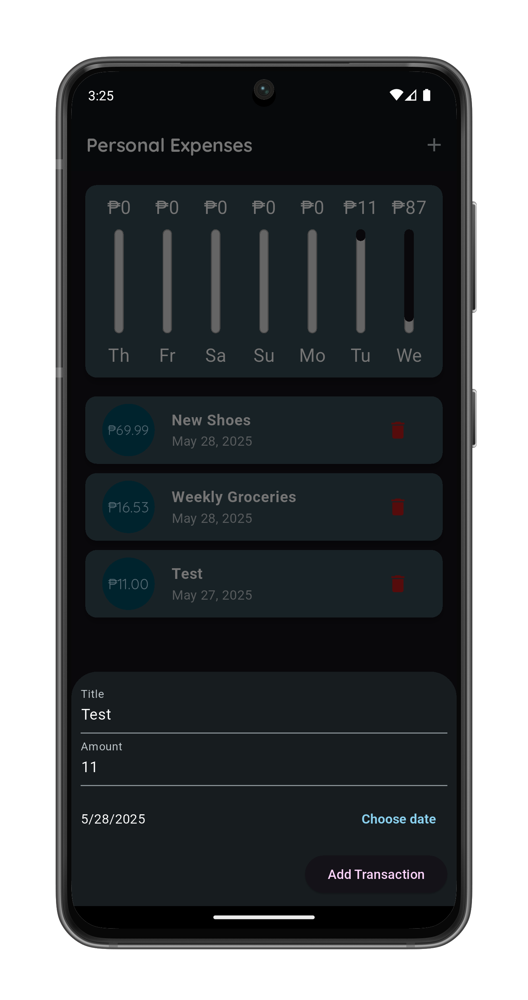    |                                                                               |
| 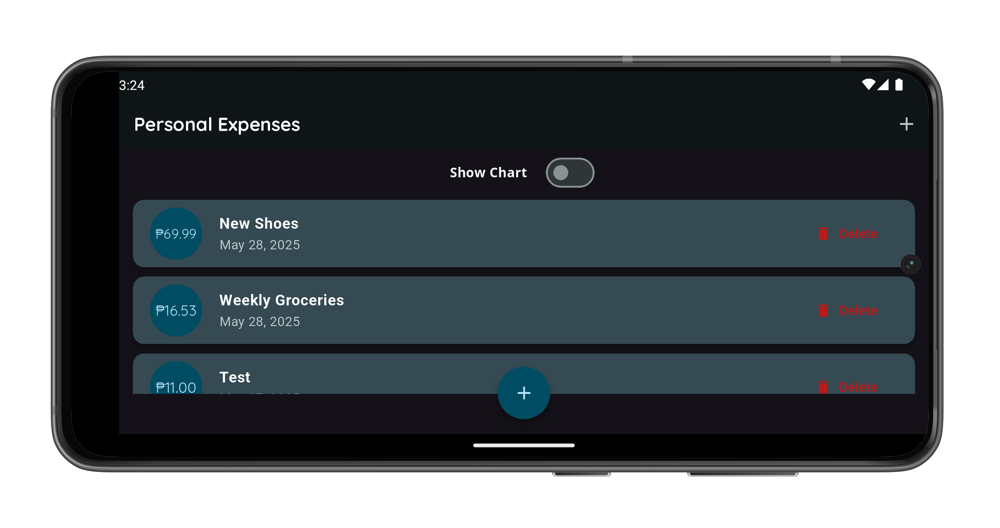   | 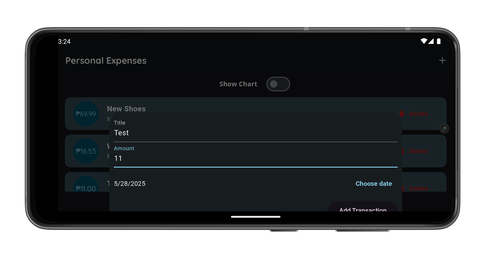   | 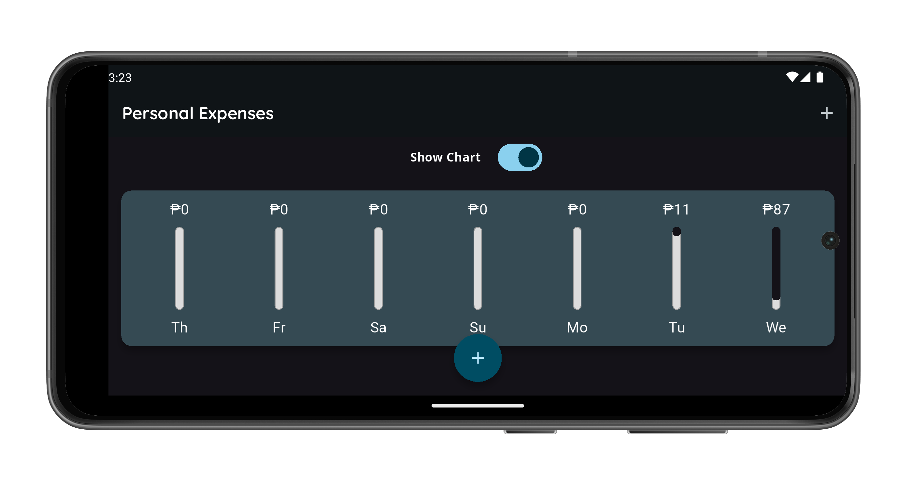   |
---

## 🌐 Live Demo

- 🔗 **Web (GitHub Pages):**  
  [Demo](https://omnitechphilippines.github.io/expense-tracker/)

---

## 📦 Download Releases

- 💻 **Windows (.7z):**  
  [Download for Windows v1.0.1+1](https://github.com/omnitechphilippines/expense-tracker/releases/download/v1.0.1%2B1/windows-release-v1.0.1%2B1.7z)

- 📱 **Android (.apk):**  
  [Download for Android v1.0.1+1](https://github.com/omnitechphilippines/expense-tracker/releases/download/v1.0.1%2B1/app-release-v1.0.1%2B1.apk)

- 🌐 **Web build (.7z):**  
  [Download Web Build v1.0.1+1](https://github.com/omnitechphilippines/expense-tracker/releases/download/v1.0.1%2B1/web-release-v1.0.1%2B1.7z)

> You can also find all versions in the [Releases Page](https://github.com/omnitechphilippines/expense-tracker/releases)

---

## 🚀 Getting Started

### Prerequisites

- Flutter SDK `v3.29.0`
- Dart SDK `v3.7.0`

### Run the app

```bash
# Clone the repo
git clone https://github.com/omnitechphilippines/expense-tracker.git
cd expense-tracker

# Get packages
flutter pub get

# Run the game (Web)
flutter run -d chrome

# Run the game (Windows)
flutter config --enable-windows-desktop
flutter run -d windows

# Run the game (Android)
flutter run -d android